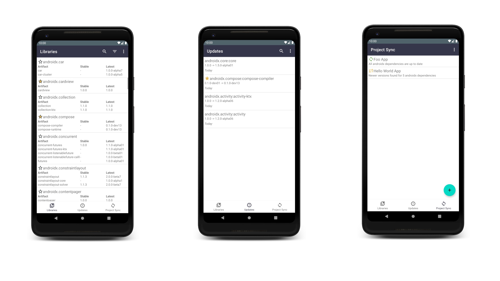

#  Jetpack Release Tracker

Jetpack Release Tracker keeps you up to date on the latest AndroidX library releases.

## Features

Features include:
* Quickly browse all the androidx.* libraries and view the latest versions
* Bookmark libraries
* Receive notifications whenever new versions of androidx libraries are released
* Monitor androidx.* dependencies in your Projects

## Download
Get the app from the [Google Play Store](https://play.google.com/store/apps/details?id=name.lmj0011.jetpackreleasetracker).

## Building from source
- clone this repo
- create a `gradle.properties` file from `gradle.properties.example`
- build app 

## Issues, Feature Requests and Contributing

Please make sure to read the full guidelines.

Bugs

* Include version information
* If not latest, try updating, it may have already been solved
* Include steps to reproduce (if not obvious from description)
* Include screenshot (if needed)
* If it could be device-dependent, try reproducing on another device (if possible)
* For large logs use http://pastebin.com/ (or similar)
* Don't group unrelated requests into one issue

Feature Requests

* Write a detailed issue, explaining what it should do or how. Avoid writing just "like X app does"
* Include screenshot (if needed)

## License

    Copyright 2020 Landan Jackson

    Licensed under the Apache License, Version 2.0 (the "License");
    you may not use this file except in compliance with the License.
    You may obtain a copy of the License at

    http://www.apache.org/licenses/LICENSE-2.0

    Unless required by applicable law or agreed to in writing, software
    distributed under the License is distributed on an "AS IS" BASIS,
    WITHOUT WARRANTIES OR CONDITIONS OF ANY KIND, either express or implied.
    See the License for the specific language governing permissions and
    limitations under the License.
